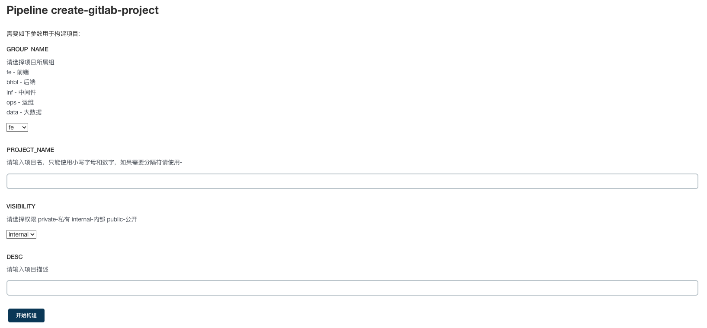

# `gitlab-project`
 auto create gitlab project

## 修改 `GitLab` 地址和 `GitLabToken` 信息

### `service/config.go` 文件

```shell
const (
	GitLabUrl   = "https://gitlab.evescn.com"   # 修改为自己的 GitLab 地址
	GitLabToken = "Nh-Gm6cZC2G4n-aF8X1t"        # 生成 Token，建议使用超管用户，对所有项目都有创建权限
)
```

## 制作 `Dcoker` 镜像

```shell
docker build -t harbor.evesc.com/devops/gitlab-project:v1.0 -f .

docker push harbor.evesc.com/devops/gitlab-project:v1.0
```

## 镜像测试

```shell
docker run -name test harbor.evesc.com/devops/gitlab-project:v1.0
docker exec -it test bash
# /app/main --groupname ops --projectname test --visibility internal --desc "test project"
```

> 登陆 `GitLab` 查看 `ops` 组下是否已经有 `test` 项目被创建

## `Jenkinsfile` 流水线

### `Jenkinsfile` 流水线参数



### `gitlab-project.groovy` 文件

```groovy
#!groovy

@Library('jenkinslib@test') _

// func from shareibrary
def mytools = new org.devops.tools()

// env 环境变量信息 GROUP_NAME PROJECT_NAME VISIBILITY DESC
mytools.PrintMessage("组：${GROUP_NAME}        权限：${VISIBILITY} \n\r 项目：${PROJECT_NAME}        描述：${DESC}", "skyblue")


// 此次构建基础信息输出
currentBuild.description = "组：${GROUP_NAME}        权限：${VISIBILITY} \n\r项目：${PROJECT_NAME}"


// 启用 podTemplate
def label = "slave-${UUID.randomUUID().toString()}"

podTemplate(
    label: label,
    containers: [
        containerTemplate(name: 'main', image: 'harbor.evescn.com/devops/gitlab-project:v1.0', command: 'cat', ttyEnabled: true),
    ], 
    serviceAccount: 'devops',
) {
    node(label) { 
        try {
            stage('创建 GitLab 项目') {
                container('main') {
                    mytools.PrintMessage("创建 GitLab 项目", "green")
                    sh '''
                    cd /app/
                    /app/main --groupname ${GROUP_NAME} --projectname ${PROJECT_NAME} --visibility ${VISIBILITY} --desc "${DESC}"
                    '''
                }
            }

        } catch (Exception e) {
            println(e)
        } finally {
            
        }
    }
}
```

### `tools.groovy` 文件

```groovy
package org.devops

//格式化输出
def PrintMes(value,color){
    colors = ['red'   : "\033[40;31m >>>>>>>>>>>${value}<<<<<<<<<<< \033[0m",
              'blue'  : "\033[47;34m ${value} \033[0m",
              'green' : ">>>>>>>>>>${value}>>>>>>>>>>",
              'green1' : "\033[40;32m >>>>>>>>>>>${value}<<<<<<<<<<< \033[0m" ]
    ansiColor('xterm') {
        println(colors[color])
    }
}

```